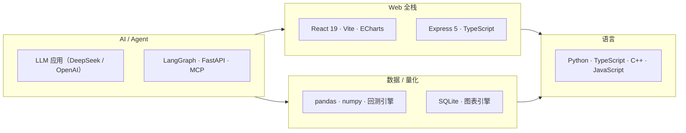

# 👋 Hi there，我是 J

  
  
  
  
  
  

热爱把 AI 变成真正可用的工具。这里是我 10 个公开项目中的精选，全部可独立运行：

## 🏗️ 项目矩阵

| 项目 | 一句话简介 | 亮点 |
|---|---|---|
| 🏦 [stock-research-system](https://github.com/xiaomaozjj666/stock-research-system) | A 股全栈智能投研平台 | 多专家协同研判 · 量化回测（DSR / CSCV / Walk-Forward）· 模拟盘闭环 |
| 📊 [data-analysis-agent](https://github.com/xiaomaozjj666/data-analysis-agent) | LLM 端到端数据分析工作台 | 上传数据 → 自动清洗 → 统计 → 可视化报告，Plan-and-Execute + ReAct |
| 🐛 [issue-agent](https://github.com/xiaomaozjj666/issue-agent) | GitHub Issue 根因分析智能体 | 有界工具循环 + 行级证据 + 修复补丁，默认只读 |
| 🕷️ [web-crawler](https://github.com/xiaomaozjj666/web-crawler) | Scrapling 风格隐身爬虫库 | TLS 指纹隐身 · 自适应选择器 · JS 逆向 Agent · 验证码识别 |
| 🛡️ [relay-audit](https://github.com/xiaomaozjj666/relay-audit) | OpenAI 兼容中转 API 质检工具 | 20+ 项安全/质量检测，一键 HTML 报告 |
| 🔢 [base-conversion](https://github.com/xiaomaozjj666/base-conversion) | 三语言进制转换 + 算法演示 | C++ / Python / JS 同函数对照，真实耗时实测图表 |
| 📚 [programming-exercises](https://github.com/xiaomaozjj666/programming-exercises) | 多语言编程入门练习 | C / C++ / JS / Python 示例，CI 自动编译校验 |
| 🧰 [code-practice](https://github.com/xiaomaozjj666/code-practice) | 多语言练习项目骨架 | 标准化目录结构，四种语言开箱即用 |

## 🧰 技术栈

## 📈 数据一览

| 指标 | 数值 |
|---|---|
| 公开仓库 | 10 个（含 8 个精选项目） |
| 语言覆盖 | Python · TypeScript · JavaScript · C++ · C · Java · Vue · C# |
| 测试习惯 | 单测 / E2E / CI 门禁全覆盖 |

---

> 💡 所有项目均提供一键启动（Windows `.bat` / `.cmd`）与 Docker 部署方式，欢迎 Star ⭐ 与 Issue 交流。
