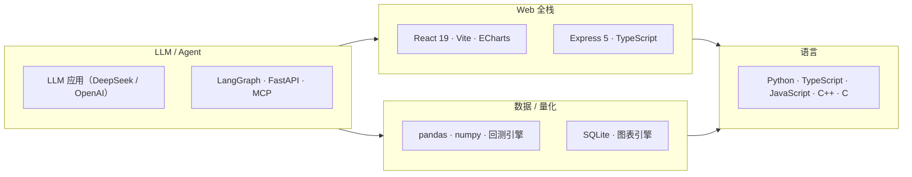

# 👋 Hi there，我是 J

  
  
  
  
  
  

热爱把大模型能力变成真正可用的工具。以下是我全部 **9 个活跃公开仓库** 的速览（另有 2 个已合并归档：`base-conversion`、`code-practice`，内容均已并入 [programming-exercises](https://github.com/xiaomaozjj666/programming-exercises)；另有 3 个私有仓库）：

## 🏗️ 精选项目

| 项目 | 一句话简介 | 亮点 |
|---|---|---|
| 🏦 [stock-research-system](https://github.com/xiaomaozjj666/stock-research-system) | A 股全栈智能投研平台 | 多专家协同研判 · 量化回测（DSR / CSCV / Walk-Forward）· 模拟盘闭环 |
| 📊 [data-analysis-agent](https://github.com/xiaomaozjj666/data-analysis-agent) | 端到端数据分析工作台 | 上传数据 → 自动清洗 → 统计 → 可视化报告，Plan-and-Execute + ReAct |
| 🐛 [issue-agent](https://github.com/xiaomaozjj666/issue-agent) | GitHub Issue 根因分析智能体 | 有界工具循环 + 行级证据 + 修复补丁，默认只读 |
| 🕷️ [web-crawler](https://github.com/xiaomaozjj666/web-crawler) | Scrapling 风格隐身爬虫库 | TLS 指纹隐身 · 自适应选择器 · JS 逆向 · 验证码识别 |
| 🛡️ [relay-audit](https://github.com/xiaomaozjj666/relay-audit) | OpenAI 兼容中转 API 质检工具 | 20+ 项安全/质量检测，一键 HTML 报告 |
| 📚 [programming-exercises](https://github.com/xiaomaozjj666/programming-exercises) | 多语言编程练习（三仓合一） | 四语示例 + 三语进制转换（负数/小数）+ 项目骨架 |
| 🔧 [deepseek-harness](https://github.com/xiaomaozjj666/deepseek-harness) | DeepSeek Harness 官方框架 fork | 插件化 Agent 框架，本地维护与学习 |
| 👁️ [dsh-plugin-describe-image](https://github.com/xiaomaozjj666/dsh-plugin-describe-image) | describe_image 插件 fork | 给纯文本模型接入视觉能力的 VLM 工具插件 |

## 🗂️ 全部公开仓库

1. 🏦 [stock-research-system](https://github.com/xiaomaozjj666/stock-research-system) — A 股智能投研平台
2. 📊 [data-analysis-agent](https://github.com/xiaomaozjj666/data-analysis-agent) — 数据分析工作台
3. 🐛 [issue-agent](https://github.com/xiaomaozjj666/issue-agent) — Issue 根因分析智能体
4. 🕷️ [web-crawler](https://github.com/xiaomaozjj666/web-crawler) — 隐身爬虫库
5. 🛡️ [relay-audit](https://github.com/xiaomaozjj666/relay-audit) — 中转 API 质检
6. 📚 [programming-exercises](https://github.com/xiaomaozjj666/programming-exercises) — 多语言编程练习
7. 🔧 [deepseek-harness](https://github.com/xiaomaozjj666/deepseek-harness) — Harness 框架 fork
8. 👁️ [dsh-plugin-describe-image](https://github.com/xiaomaozjj666/dsh-plugin-describe-image) — 识图插件 fork
9. 👤 [xiaomaozjj666](https://github.com/xiaomaozjj666/xiaomaozjj666) — 本主页仓库

## 🧰 技术栈

## 📈 数据一览

| 指标 | 数值 |
|---|---|
| 公开仓库 | 9 个活跃 + 2 个已归档（含 2 个 fork 与本主页） |
| 私有仓库 | 3 个（不在此列出） |
| 语言覆盖 | Python · TypeScript · JavaScript · C++ · C |
| 测试习惯 | 单测 / E2E / CI 门禁全覆盖 |

---

> 💡 所有项目均提供一键启动（Windows `.bat` / `.cmd`）与 Docker 部署方式，欢迎 Star ⭐ 与 Issue 交流。
